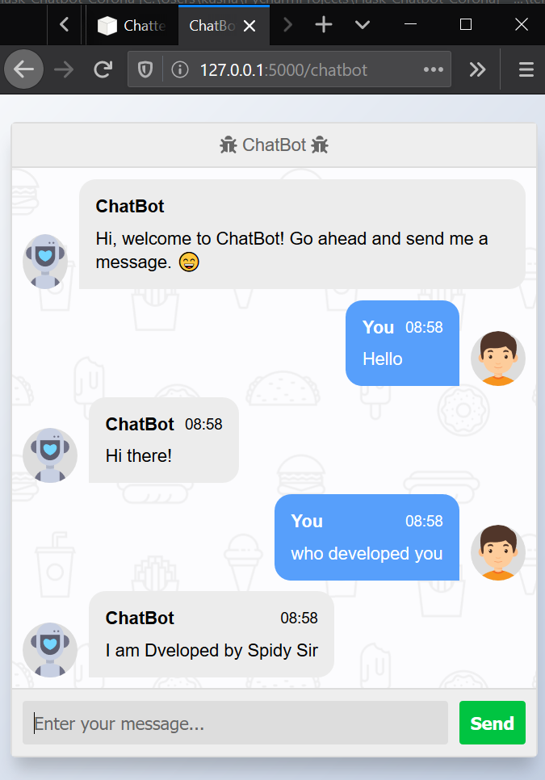

ChatBot💬 WebApp in Python using Flask

forthebadge made-with-python
Python 3.6
Follow us on Instagram for Machine Learning Guidelines & Path
Donate me on PayPal(It will inspire me to do more projects)
Donate me on GPAY:- kushalbhavsar58-1@okaxis
Usage:-

    Download this repository via GIT or zip.
    Open CMD in directory of this repository(Python 3.6 should be installed)
    type pip install -r requirements.txt.
    After installation run app.py.
    Go to the 127.0.0.1:5000/chatbot, You can start chatting.

1

Notes:-

    This is just basic chatbot, you can improve chatbot learning. Read documentation
    For better Chatbot development you can use Dialogflow.
    Even you can do better chatbot development with this strategy also. You just need to train a NLP model in better way.

Just follow☝️ me and Star⭐ my repository
